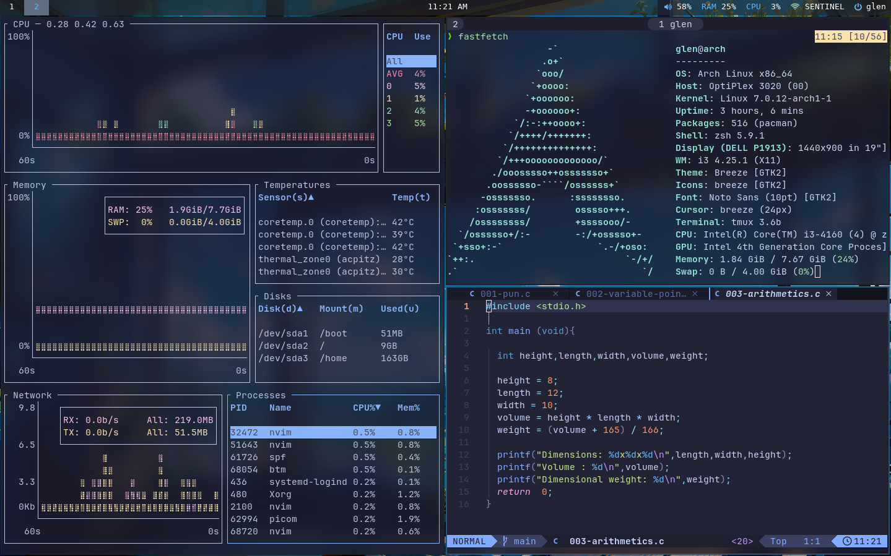
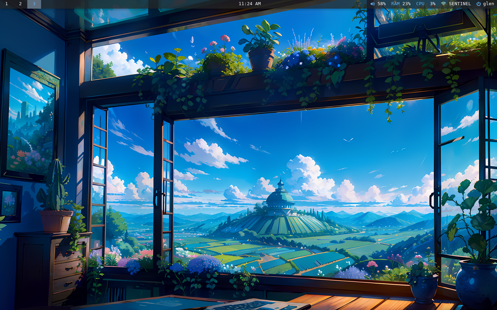
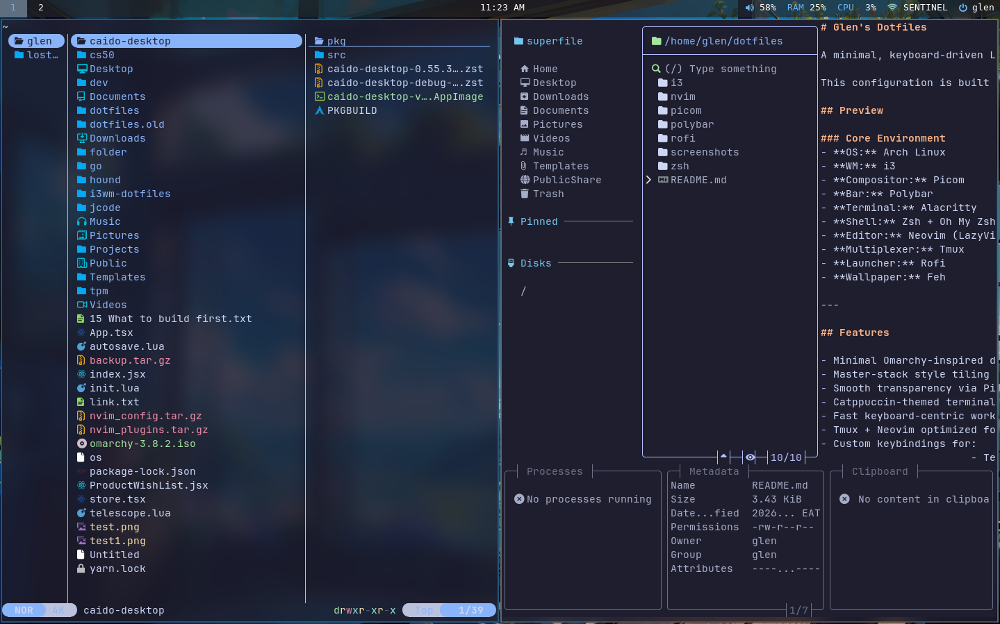
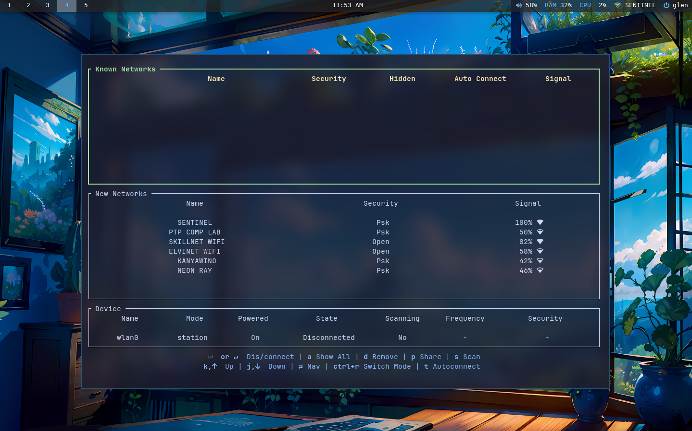
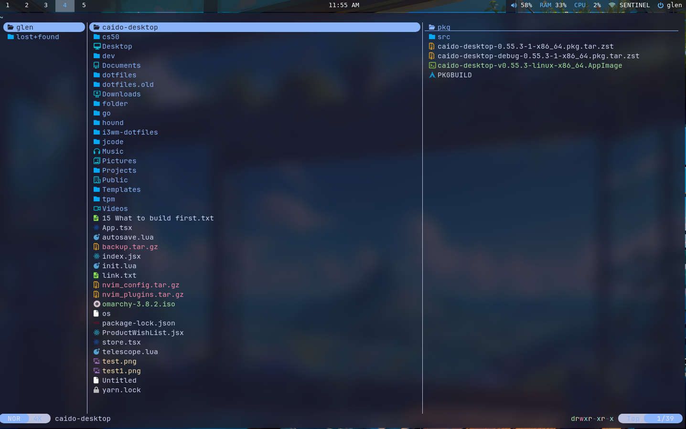

# Glen's Dotfiles

A minimal, keyboard-driven Linux setup focused on speed, productivity, and a clean aesthetic.

This configuration is built for **Arch Linux** using **i3wm** and is heavily inspired by the workflow and design philosophy of **Omarchy** — lightweight, fast, and terminal-centric.

## Preview

### Core Environment
- **OS:** Arch Linux
- **WM:** i3
- **Compositor:** Picom
- **Bar:** Polybar
- **Terminal:** Alacritty
- **Shell:** Zsh + Oh My Zsh
- **Editor:** Neovim (LazyVim-based)
- **Multiplexer:** Tmux
- **Launcher:** Rofi
- **Wallpaper:** Feh

---

## Features

- Minimal Omarchy-inspired desktop
- Master-stack style tiling in i3
- Smooth transparency via Picom
- Catppuccin-themed terminal and editor
- Fast keyboard-centric workflow
- Tmux + Neovim optimized for development
- Custom keybindings for:
  - Terminal
  - Browser
  - YouTube PWA
  - Instagram PWA
  - File manager
  - Volume / Wi-Fi menus
- Dotfile management using **GNU Stow**

---

## Directory Structure

```bash
dotfiles/
├── alacritty/
├── feh/
├── i3/
├── nvim/
├── picom/
├── polybar/
├── rofi/
├── tmux/
└── zsh/
```

---

## Installation

### Clone the repository

```bash
git clone git@github.com:glenspiky/dotfiles.git ~/dotfiles
cd ~/dotfiles
```

### Install GNU Stow

Arch Linux:

```bash
sudo pacman -S stow
```

### Symlink configs

```bash
stow i3
stow alacritty
stow picom
stow polybar
stow rofi
stow nvim
stow zsh
stow feh
```

---

## Required Packages

Install core dependencies:

```bash
sudo pacman -S \
i3-wm \
polybar \
picom \
alacritty \
rofi \
feh \
tmux \
neovim \
zsh \
git \
ripgrep \
fd \
fzf \
playerctl \
networkmanager
```

Optional but recommended:

```bash
sudo pacman -S \
bat \
eza \
zoxide \
btop \
fastfetch
```

---

## Keybindings

| Keybinding | Action |
|-----------|--------|
| `Mod + Enter` | Open Alacritty |
| `Mod + Space` | Open Rofi |
| `Mod + B` | Open Chrome |
| `Mod + E` | Open File Manager |
| `Mod + Y` | Open YouTube |
| `Mod + I` | Open Instagram |
| `Mod + Shift + Q` | Close Window |

Navigation uses Vim-style movement:

| Key | Direction |
|-----|-----------|
| `Mod + h` | Left |
| `Mod + j` | Down |
| `Mod + k` | Up |
| `Mod + l` | Right |

---

## Theming

This setup uses:

- **Catppuccin Mocha**
- Rounded UI where possible
- Transparent terminal
- Clean minimal status bars
- macOS-inspired font rendering

Recommended fonts:

- JetBrainsMono Nerd Font
- SF Pro (if available)
- Inter
- Berkeley Mono (optional)

---

## Neovim Setup

This config uses a **LazyVim-based setup** with:

- LSP
- Treesitter
- Autocomplete
- Formatting
- Git integration
- File explorer
- Telescope

Useful shortcuts:

| Key | Action |
|-----|--------|
| `<leader>ff` | Find files |
| `<leader>fg` | Live grep |
| `<leader>e` | Explorer |
| `gd` | Go to definition |

---

## Tmux

Configured for:

- Vim-style pane navigation
- Catppuccin theme
- Mouse support
- Session persistence
- Better clipboard handling

Prefix:

```bash
Ctrl + a
```

---

## Philosophy

This setup is built around a few principles:

- Keyboard first
- Minimal distractions
- Fast startup
- Low memory usage
- Beautiful but functional UI

The goal is to make the machine feel like an extension of thought.

---

## Screenshots

_Add screenshots here later._

Example:


[](screenshots/screen1.png)
[](screenshots/screen2.png)
[](screenshots/screen3.png)
[](screenshots/screen4.png)
[](screenshots/screen5.png)


## Author

**Glen Barasa**  
Frontend Developer | Linux Enthusiast | Builder

GitHub: https://github.com/glenspiky
